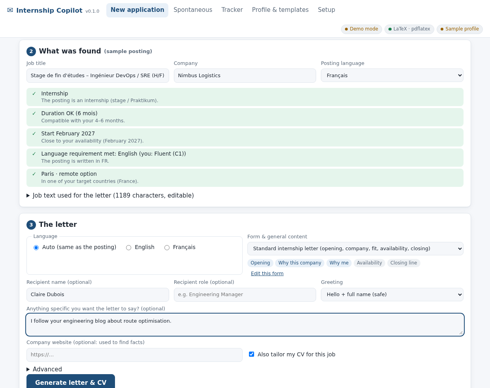
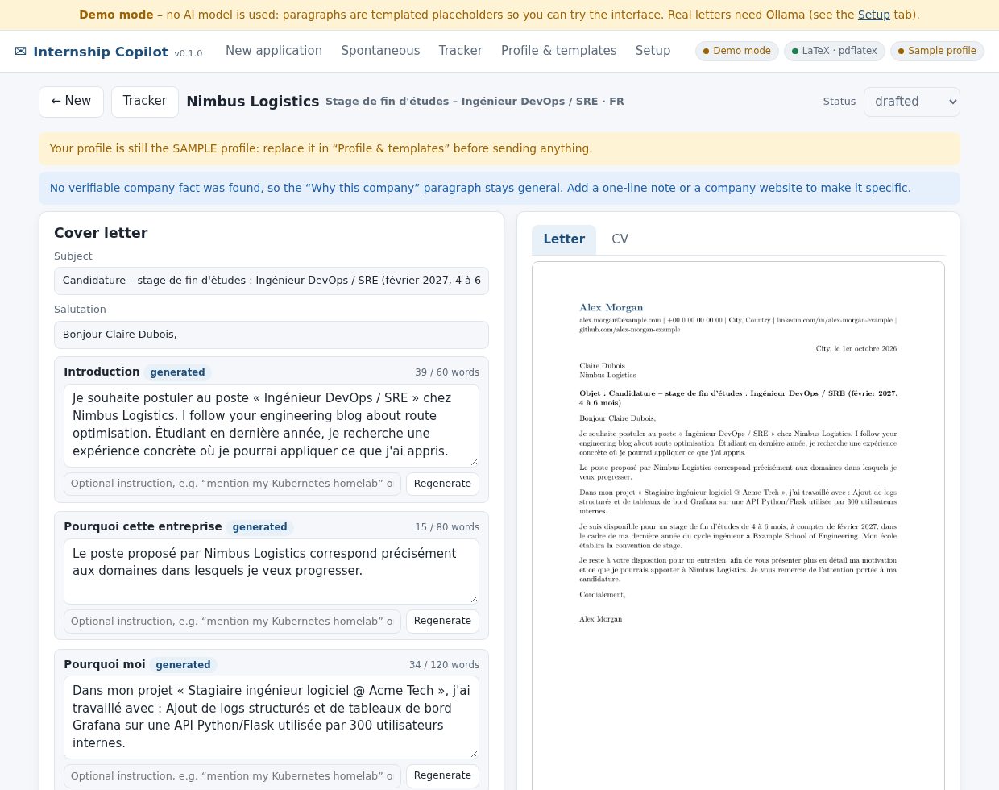
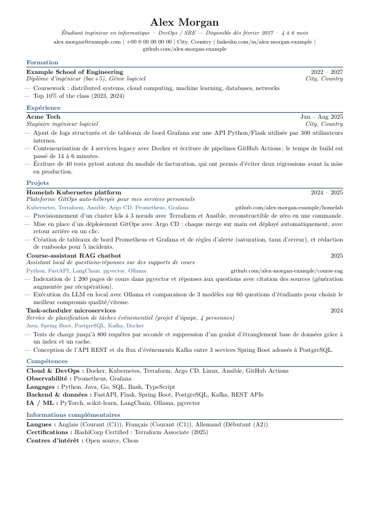

# Internship Copilot

A **local** assistant for applying to end-of-studies software-engineering internships (development, AI, SRE, DevOps) in France and Germany.

* **Job link → cover letter + tailored CV.** You paste a posting link. The app reads the posting, checks it against your availability (Feb 2027, 4–6 months), picks the projects of yours that matter for that job, writes the letter in the **form you chose beforehand** (a *blueprint*: pick one of the shipped forms or make your own), and compiles letter and CV with **your LaTeX**.
* **Spontaneous application → personalised e-mail.** You give a company and a contact person; it writes a short e-mail (copy it, open it in your mail app, or download an `.eml` draft) and prepares a CV to attach.
* **Tracker** with follow-up dates and CSV export.
* **Private by design.** The model runs on your machine through [Ollama](https://ollama.com). Nothing is ever sent or submitted automatically: you review, edit and send everything yourself.



| Review and edit (left), live PDF (right) | The tailored one-page CV (LaTeX) |
|---|---|
|  |  |

---

## 1. Quick start

You need: **Python 3.10+**, **[Ollama](https://ollama.com/download)**, and a **LaTeX distribution** (TeX Live / MacTeX on Linux & macOS, MiKTeX on Windows).

```bash
ollama pull gemma4:e4b      # the default model; see "Choosing a model" for lighter or stronger ones
./start.sh                  # Windows: double-click start.bat
```

The first run creates a virtual environment, installs the dependencies and opens <http://localhost:8765>.
`python -m copilot doctor` checks Python, LaTeX, Ollama and your profile and tells you how to fix what is missing.

> **No Ollama yet?** Start with `COPILOT_LLM=fake ./start.sh` (demo mode): the interface works with templated placeholder text, so you can explore everything first.

## 2. One-time setup (about 30 minutes, worth it)

Everything personal lives in the **`data/`** folder (git-ignored) and is editable from the **Profile & templates** tab.

| What | File | Why it matters |
|---|---|---|
| **Your facts** | `profile.yaml` | The *only* source of facts for letters and CVs. Replace the sample ("Alex Morgan"), then delete `example: true`. Concrete bullets with tools **and numbers** produce much better letters. Text can be a string or `{en: ..., fr: ...}`. |
| **Letter forms** | `blueprints/letter*.yaml` | A *form* = tone, phrases to avoid, paragraph order, which paragraphs are *written by the model* (`generated`: with a goal and a style example) and which are *your own fixed text* (`fixed`: availability, closing...). Three ship with the app: **Standard** (opening, company, fit, availability, closing), **Short & direct** (motivation, fit, availability) and **Project first** (proof of work, then why this company). You pick one on every "New application"; edit it, or press **Duplicate as a new form…** in the editor to make your own. |
| **Spontaneous e-mail form** | `blueprints/email*.yaml` | Same idea: hook → value → ask (duplicate it for variants). |
| **Your CV layout** | `templates/cv.tex.j2` | Your LaTeX. See [Use your own LaTeX CV](#4-use-your-own-latex-cv). |
| **Letter layout** | `templates/letter.tex.j2` | The PDF layout of the letter. |
| **Your voice** *(optional)* | `examples/*.txt` | Drop 1–3 of your best past letters here. The model imitates their voice and rhythm (never their facts). |
| **Settings** | `config.yaml` | Model, context size, page limit, etc. |

Use the **Check only** button before saving: it validates YAML, placeholders and LaTeX variable names (a typo like `\VAR{p.nmae}` is caught immediately, not at generation time).

## 3. Everyday use

**New application**

1. Paste the job link and press *Fetch*. The page is read from its structured data (`JobPosting` JSON-LD) or its main text.
2. Check the **fit list**: contract type (internship vs apprenticeship / senior role), duration vs 4–6 months, start date vs February 2027, required languages vs yours, location, expiry. These are plain rules: instant, no AI.
3. Choose the **form** of the letter (Standard / Short & direct / Project first / yours), and optionally add the recipient's name, a one-line note ("I read your post about …") and the company website (used to find company facts).
4. *Generate*. Depending on your hardware this takes from 20 seconds (GPU) to a few minutes (CPU). You can cancel at any time.
5. **Review**: edit any paragraph, regenerate one paragraph with an instruction ("mention my Kubernetes homelab", "shorter"), untick or reorder CV projects, then *Save & rebuild PDF*. Download the PDFs, or open the `.tex` in Overleaf.
6. Send it yourself, then click **I sent it today**: a follow-up date is set (default 10 days).

**Spontaneous**: company, contact person, the domains you aim at (DevOps, SRE, AI/ML...), an optional website and personal note. You get an e-mail (subject + body), a `mailto:` link, an `.eml` draft with the CV attached, and the tailored CV.

**Tailor CV**: paste a job description (no AI model needed, instant). The app detects the technologies the recruiter asks for (EN/FR/DE aliases), shows a keyword match score, and proposes the keywords your profile really backs: they are added to the CV (under *Other keywords* in Skills) while projects and bullets are reordered for the posting. Keywords the recruiter wants but your profile lacks are shown as **gaps**; they are never added unless you tick them. *Build tailored CV* creates a *CV only* entry in the Tracker, opened in the usual workspace (edit keywords, projects, bullets, rebuild, download the PDF or `.tex`).

**Sites that block automatic reading** (LinkedIn, Indeed, Glassdoor and Welcome to the Jungle sometimes refuse automated requests): use the **bookmarklet** (Setup tab: drag *Send to Copilot* to your bookmarks bar, then click it on the job page; if you select the description first, only the selection is sent) or simply **paste the text**. Both always work. The app never tries to evade a site's bot protection.

### A realistic plan for a February 2027 start

| When | What |
|---|---|
| This week | Setup above; build a test CV (EN and FR) in the *Profile & templates* tab; try 2–3 postings and tune the blueprint's `goal` / `example` texts until the paragraphs sound like you. |
| Oct–Dec 2026 | Daily loop: 5–10 targeted applications per week (quality over volume: read every letter). Use the fit chips to skip apprenticeships, senior roles and wrong dates early. |
| In parallel | Spontaneous e-mails to named people at 20–30 companies you actually like (platform / SRE / ML teams); follow up once after ~10 days. |
| Germany | Postings in German produce an **English** letter plus a warning (letters are French or English only): apply when English is explicitly fine. |
| Always | Keep the tracker current; export the CSV when you want an overview. |

## 4. Use your own LaTeX CV

The CV template is *your* LaTeX with a few loops. Keep your preamble and macros; replace the static content with the loops:

```latex
% before (static)
\section{Projects}
\resumeSubheading{Homelab}{2024}{GitOps platform}{GitHub}
\resumeItemListStart
  \resumeItem{Provisioned a 3-node k3s cluster with Terraform and Ansible.}
\resumeItemListEnd

% after (template)
\section{\VAR{L.projects}}
\BLOCK{ for p in projects }
\resumeSubheading{\VAR{p.name}}{\VAR{p.period}}{\VAR{p.tagline}}{\VAR{p.stack}}
\resumeItemListStart
\BLOCK{ for b in p.bullets }
  \resumeItem{\VAR{b}}
\BLOCK{ endfor }
\resumeItemListEnd
\BLOCK{ endfor }
```

* `\VAR{x}` prints a value **escaped for LaTeX** (`&`, `%`, `_`, `#`... are safe). `\VAR{x|raw}` prints raw LaTeX.
* `\BLOCK{ if ... }`, `\BLOCK{ for ... }` are Jinja control tags; `\#{ comment }` is a template comment. (These delimiters never clash with LaTeX braces.)
* Variables: `name`, `headline`, `contact_line`, `education[]`, `experience[]`, `projects[]` (`name tagline stack period link link_text bullets[]`), `skills[]` (`category items`), `languages[]`, `certifications[]`, `interests[]`, `L.<label>` (localised section titles), `lang`, `babel`.
* The tailored CV only **selects and reorders** what is in your profile; it never invents anything. It trims the least relevant bullets until it fits `latex.max_cv_pages` (default 1).
* Custom `.cls` / `.sty` files or images: put them in `data/templates/assets/` (added to LaTeX's search path). Need XeLaTeX/LuaLaTeX? Set `latex.engine` in `config.yaml`.
* *Build test CV (EN / FR)* in the template editor compiles it with your profile; errors show the LaTeX log excerpt.

## 5. How it stays honest

Small local models can embellish. The app is built around that fact:

1. **Facts come only from `profile.yaml`.** The model is shown your most relevant projects/experience (ranked by detected technologies + TF-IDF), nothing else about you.
2. **Company facts must be quoted.** A fact about the company is used only if the model gives a *verbatim quote* that is found in the posting or the company website (accents/case ignored; changed numbers are rejected). No quote, no fact: the "Why this company" paragraph then stays general and the app tells you why.
3. **Deterministic where it can be.** Subject, salutation, dates, duration, availability sentence, closing and signature are templates, not generated text.
4. **Every generated paragraph is fact-checked**: tools not in your profile (info if the posting names them, warning otherwise), numbers not found in your sources, *number + unit* mismatches (`6 minutes` vs `6 hours`, in FR/EN/DE, digits or words), phrases you asked to avoid, wrong language, placeholders, **facts or names copied from the style example**, sentences **repeated** from an earlier paragraph (removed automatically), your **personal note being ignored** in the opening paragraph, and length. Blocking problems trigger one automatic rewrite with the exact problems named; what remains is shown as flags next to the paragraph. (These checks exist because a real small model did every one of these during development.)
5. **Nothing leaves your machine** except fetching the page you ask for (and the company site, if you give one) and talking to Ollama on localhost. Nothing is submitted for you.

These checks reduce risk; they do not replace reading. Qualitative exaggerations ("I mastered...") are not detectable by rules.

## 6. Choosing a model

Set it in the **Setup** tab (or `llm.model` in `config.yaml`). Rough guidance (sizes from ollama.com, approximate):

| Model | Disk | Good for |
|---|---|---|
| `qwen3.5:4b` | 3.4 GB | modest laptops (8 GB RAM), quick drafts |
| `gemma4:e4b` *(default)* | ≈ 7–10 GB | good FR/EN on a 16 GB laptop |
| `qwen3.5:9b` | 6.6 GB | better writing, 16 GB RAM or a GPU with 8+ GB |
| `gemma4:12b` | ≈ 8 GB | best quality that still fits 16 GB |
| `qwen3.5:27b` | 17 GB | 32 GB RAM / 24 GB GPU |

Without a GPU expect roughly 2–5 minutes per application (5 model calls); with a GPU, well under a minute. Memory is the usual problem: if you see *"the model process stopped… out of memory"*, close programs, pick a smaller model, or lower `llm.num_ctx`. "Thinking" mode is switched off (`llm.think: "off"`) because it is slow and not needed here.

## 7. Troubleshooting

| Symptom | Fix |
|---|---|
| Pill says *Ollama not running* | Start the Ollama app (or `ollama serve`). |
| *Model … is not installed* | `ollama pull <model>` or pick an installed one in Setup. |
| *No LaTeX (.tex only)* | Install TeX Live / MacTeX / MiKTeX. The `.tex` files are still produced (open them in Overleaf). Missing packages: `texlive-latex-extra texlive-lang-french`. |
| *Site refuses automated requests* | Use the bookmarklet or paste the text. |
| Letter or CV is 2 pages | CV: automatic trimming. Letter: shorten a paragraph (`max_words` in the blueprint). |
| French accents / quotes look wrong | The templates use `T1` + `utf8` + `babel`; keep them in your own template. |
| A paragraph invents things | Read its flags; regenerate with an instruction; try a bigger model; add facts to your profile. |

## 8. Project map

```
copilot/
  fetch.py       job link -> Job (JSON-LD -> main text -> optional browser; bot-wall detection; private-network guard)
  fit.py         rule-based fit check (FR/EN/DE regexes: duration, start, contract type, languages, expiry)
  techvocab.py   ~200 technologies with FR/DE aliases and ambiguity rules (Go, R, C, React vs "react"...)
  retrieve.py    ranks your projects/experience for a job; builds the CV plan (selection + order only)
  tailor.py      "Tailor CV": job keywords vs your profile -> keyword report, gaps, CV plan with extra keywords
  analyze.py     job analysis (schema-constrained JSON) + verified company facts
  prompts.py     all prompt text in one place
  letter.py      blueprint -> paragraphs (LLM or fixed), salutation, subject, LaTeX/e-mail outputs
  grounding.py   fact-checks every generated paragraph
  cv.py latex.py CV context + page-fit loop; escaping, Jinja environment, compilation
  llm.py         Ollama client (streaming, cancel, think handling, friendly errors) + demo backend
  pipeline.py    the end-to-end flows, regeneration, edits
  tasks.py       one LLM job at a time, progress, cancel
  server.py      FastAPI JSON API + static UI (Host/Origin guards; binds to localhost)
  static/        the single-page UI (vanilla JS, no external resources)
  defaults/      sample profile, blueprints, LaTeX templates, sample postings
data/            YOUR files (created on first run, git-ignored)
tests/           pytest suite
```

Data per application: `data/applications/<date>-<company>-<role>/` with `state.json`, `letter.tex/.pdf`, `cv.tex/.pdf` (or `email.txt/.eml`).

## 9. Development & tests

```bash
pip install -r requirements-dev.txt
pytest                                  # ~130 tests, ~25 s (needs a LaTeX engine for the PDF tests)
COPILOT_LIVE=1 pytest tests/test_live.py   # opt-in smoke tests against real LinkedIn / Lever / Greenhouse pages
python tests/ui_smoke.py http://localhost:8765 /tmp/shots   # optional browser walkthrough (playwright)
python tests/ui_bookmarklet.py http://localhost:8765 /tmp/shots   # optional: runs the real bookmarklet on a job page
```

Command line: `python -m copilot serve --port 8765 [--open] [--allow-any-host]`, `python -m copilot doctor`, `python -m copilot init`.
Environment: `COPILOT_DATA` (data folder), `COPILOT_LLM=fake` (demo backend), `COPILOT_MODEL`, `OLLAMA_HOST`, `COPILOT_ALLOWED_HOSTS` (extra accepted Host names).

## 10. Honest status and limits

* Built and tested end-to-end (fetching, fit rules, retrieval, grounding, LaTeX, API, UI, bookmarklet in a real browser) in a small sandbox. The **model-written prose** was exercised there only with a tiny 0.8B model and a deterministic demo backend, so the quality you get with `gemma4` / `qwen3.5` models is not benchmarked here: try 2–3 postings and tune the blueprint's `goal` and `example` texts (they steer the model a lot).
* Windows and macOS were not tested (code is cross-platform: `pathlib`, no shell calls); LaTeX packages are standard (`lmodern`, `enumitem`, `titlesec`, `microtype`, `babel`, `hyperref`).
* Letters are written in French or English only. German postings get an English letter and a warning.
* Reading job pages is best effort and follows each site's responses; if a site blocks, you paste or use the bookmarklet.
